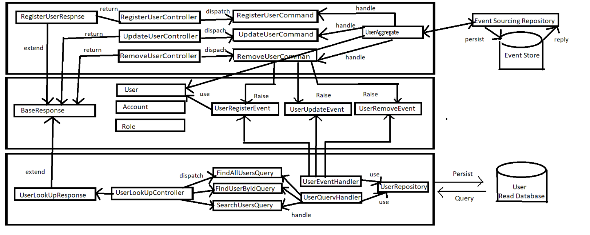
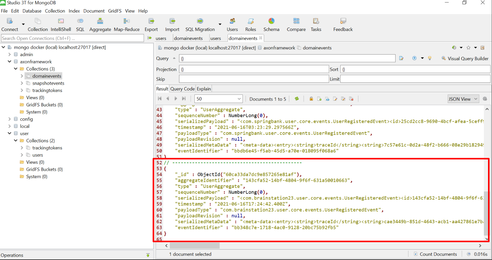

=== CQRS and Event Sourcing
:description: CQRS and Event Sourcing in Spring Boot.
:keywords: java, CQRS, Event Sourcing,Axon, MongoDb, programming, spring, spring boot.

CQRS stands for Command and Query Responsibility Segregation, a pattern that separates read and update operations for a data store. Implementing CQRS in your application can maximize its performance, scalability, and security.

The fundamental idea of Event Sourcing is that of ensuring every change to the state of an application is captured in an event object, and that these event objects are themselves stored in the sequence they were applied for the same lifetime as the application state itself.

=== Demo Project Diagram

== Tools
. JDK > 8
. Axon Server
. MongoDb
. IDE

=== Request Payload

 {
   "user":{
      "firstname": "Abdur Rahim",
      "lastname": "Nishad",
      "emailAddress": "nishad5089@gmail.com",
      "account": {
           "username": "nishad",
           "password": "12345789",
           "roles": ["READ_PRIVILEGE", "WRITE_PRIVILEGE"]
          }
      }
  }

=== Response Payload
    {
    "message": "User successfully registered!",
    "id": "143cfa52-14bf-4804-9f6f-631a50010663"
    }

=== Events

